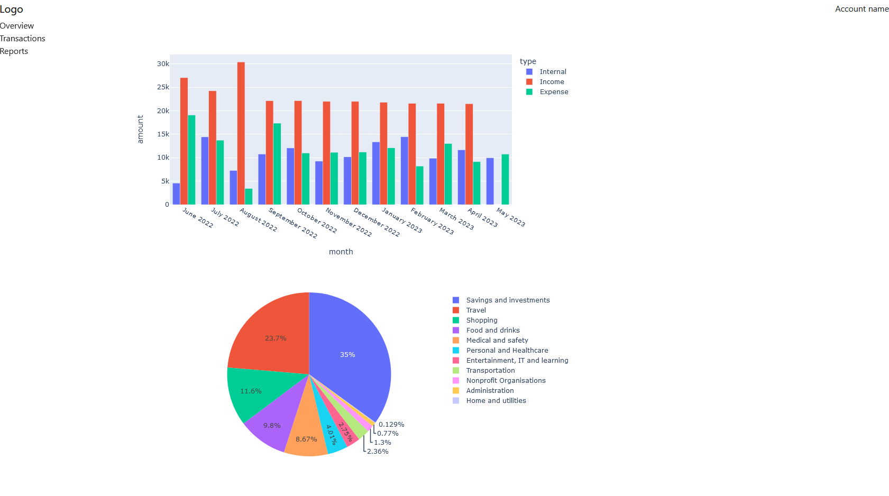

# Budget Web App
Work in progress...

## What?
Web app which shows transactions on chosen bank accounts and presents insights
on spending categories and budget.

## Why?
I have not yet found a budgetting app which allows both automatic retrieval of 
transactions for my bank and customisation of spending categories. I do not want
to manually type transactions and I want to create speding categories that fit 
with my lifestyle.  

## How?
I intend to write the app in Python and Flask, and retrieve banking transactions
via the Nordigen API. For graphs, I am using the plotly.py library. For CSS, I 
am using the Bootstrap framework.

